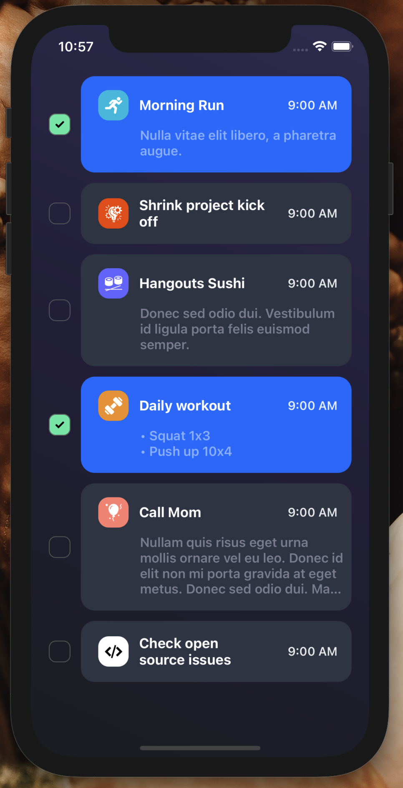

[](https://github.com/WrathChaos/react-native-checkbox-flex)

[](https://www.npmjs.com/package/react-native-checkbox-flex)
[](https://www.npmjs.com/package/react-native-checkbox-flex)

[](https://opensource.org/licenses/MIT)
[](https://github.com/prettier/prettier)

<table>
  <tr>
    <td align="center">
      
    </td>
    <td align="center">
      
    </td>
   </tr>
</table>

# Installation

Add the dependency:

```bash
npm i react-native-checkbox-flex
```

## Peer Dependencies

<h5><i>IMPORTANT! You need install them</i></h5>

```js
"@freakycoder/react-native-bounceable": "^0.2.4",
```

# Usage

## Import

```jsx
import CheckboxFlex from "react-native-checkbox-flex";
```

## Fundamental Usage

```jsx
<CheckboxFlex
  title="Morning Run"
  date="9:00 AM"
  description="Nulla vitae elit libero, a pharetra augue."
  imageSource={require("./assets/running.png")}
/>
```

## Example Project 😍

You can checkout the example project 🥰

Simply run

- `npm i`
- `react-native run-ios/android`

should work of the example project.

# Configuration - Props

activeCardBackgroundColor?: string;
inactiveCardBackgroundColor?: string;

## Fundamentals

| Property    |  Type  |  Default  | Description                        |
| ----------- | :----: | :-------: | ---------------------------------- |
| title       | string | undefined | set the checkbox title             |
| date        | string | undefined | set the checkbox date              |
| description | string | undefined | set the checkbox description       |
| imageSource | image  | undefined | set the checkbox icon image source |

## Customization (Optionals)

| Property                        |    Type    |         Default         | Description                                                        |
| ------------------------------- | :--------: | :---------------------: | ------------------------------------------------------------------ |
| onPress                         |  function  |        undefined        | set your own logic for the button functionality when it is pressed |
| isActive                        |  boolean   |          false          | set the initial isActive state                                     |
| style                           | ViewStyle  |         default         | set or override the style object for the main container            |
| checkboxContainerStyle          | ViewStyle  |         default         | set or override the style object for the checkbox container        |
| iconContainerStyle              | ViewStyle  |         default         | set or override the style object for the icon container            |
| iconImageStyle                  | ImageStyle |         default         | set or override the style object for the icon image                |
| titleTextStyle                  | TextStyle  |         default         | set or override the style object for the title text                |
| dateTextStyle                   | TextStyle  |         default         | set or override the style object for the date text                 |
| descriptionTextStyle            | TextStyle  |         default         | set or override the style object for the description text          |
| titleNumberOfLines              |   number   |            2            | change the title number of lines                                   |
| checkboxBorderColor             |   color    | "rgba(100,100,100,0.9)" | change the checkbox border color                                   |
| activeCheckboxBackgroundColor   |   color    |        "#63eead"        | change the active checkbox container background color              |
| inactiveCheckboxBackgroundColor |   color    |      "transparent"      | change the inactive checkbox container background color            |
| activeCardBackgroundColor       |   color    |        "#2173FF"        | change the active card container background color                  |
| activeCheckboxBackgroundColor   |   color    |        "#343c4d"        | change the inactive card container background color                |

## Future Plans

- [x] ~~LICENSE~~
- [ ] Write an article about the lib on Medium

## Credits

Heavily Inspired by [Nazar Lenyshyn's To Do List App UI - Animation Design](https://dribbble.com/shots/14437015-To-Do-List-App-UI-Animation)

## Author

FreakyCoder, kurayogun@gmail.com

## License

React Native Checkbox Flex is available under the MIT license. See the LICENSE file for more info.
